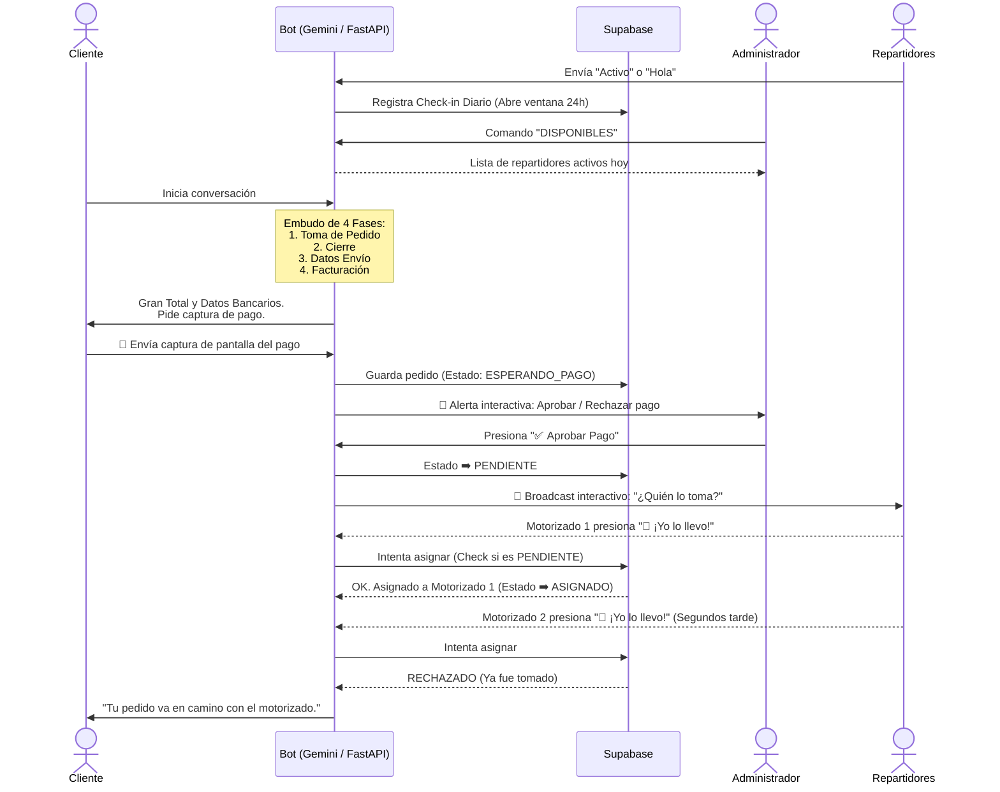

# 🍔 BurgerBot Express: IA WhatsApp Delivery Bot

Un asistente virtual de WhatsApp impulsado por IA conversacional (Gemini) que gestiona el ciclo completo de ventas: desde la toma del pedido, verificación humana de pagos, hasta la logística de asignación de repartidores (broadcast).

📖 **Ver también:** [Manual Operativo (Instrucciones de Uso)](docs/manual_operativo.md)

---

## 🎯 Sobre este proyecto
Este repositorio es un **proyecto de portafolio**. Los datos del restaurante, el menú (BurgerBot Express) y los teléfonos de contacto incluidos son **100% ficticios**. Su propósito principal es demostrar un patrón de arquitectura real y robusto que automatiza el embudo de ventas conversacional y lo conecta orgánicamente con un flujo logístico de motorizados, todo sin salir de WhatsApp.

---

## 🔄 Flujo de Trabajo (Diagrama de Arquitectura)



---

## 🚀 Tecnologías Usadas
* **Python (FastAPI):** Servidor web de alto rendimiento para procesar webhooks en tiempo real.
* **Supabase:** Base de datos PostgreSQL en la nube para persistencia de estados y comandas.
* **Meta WhatsApp Cloud API:** Integración oficial (Graph API) para recibir mensajes y renderizar componentes interactivos (botones).
* **Google Gemini AI:** Motor LLM encargado del procesamiento del lenguaje natural y contención de ventas.

---

## 🏗️ Decisiones de Arquitectura

Este proyecto resuelve tres problemas clave en operaciones de restaurantes en Latinoamérica:

1. **Human-in-the-Loop para Pagos (Prevención de Fraude):**
   * **El problema:** Procesar automáticamente capturas de transferencias locales (Zelle, Pago Móvil) es riesgoso debido a comprobantes falsificados o fondos diferidos.
   * **La solución:** La IA no aprueba el pago. Simplemente recibe la imagen y delega la decisión al dueño del negocio enviando botones interactivos a su celular. La lógica se pausa hasta la intervención humana segura.

2. **Concurrencia en la Asignación de Repartidores:**
   * **El problema:** Al enviar un Broadcast a 10 motorizados, dos podrían presionar "¡Yo lo llevo!" con milisegundos de diferencia, duplicando la orden.
   * **La solución:** Supabase actúa como fuente de la verdad. La función de asignación hace un *Check-and-Set*: solo permite la actualización si el estado actual es estrictamente `PENDIENTE`. El primero que toca la base de datos se lleva el pedido; los demás llamados son descartados silenciosamente.

3. **Fallback Manual de Tasa de Cambio (BCV):**
   * **El problema:** Las APIs gratuitas que proveen el tipo de cambio del Banco Central suelen sufrir caídas momentáneas.
   * **La solución:** Si la API externa (`DolarAPI`) no responde en 5 segundos, el sistema busca automáticamente una "tasa manual" inyectada por el Administrador, evitando que el bot se detenga o cobre el monto equivocado.

4. **📋 Registro de Disponibilidad (Check-in Diario):**
   * **El problema doble:** Meta bloquea los mensajes interactivos iniciados por el negocio si han pasado 24h desde que el usuario le escribió al bot (obligando a usar Plantillas de pago). Por otro lado, un restaurante necesita saber qué repartidores asistieron a trabajar hoy antes de que caigan pedidos.
   * **La solución elegante:** Se instauró una regla donde el personal debe escribirle al bot ("Activo") al iniciar turno. El bot intercepta esto en background, registra un `checkin_diario` en la base de datos (visibilidad operativa con el comando `DISPONIBLES`), y este mismo mensaje cumple el rol de abrir la ventana de 24 horas de Servicio de Meta, permitiendo el flujo de los botones de forma 100% gratuita todo el día.

---

## 🛠️ Instrucciones de Instalación

1. **Clonar el repositorio:**
   ```bash
   git clone https://github.com/Luiseh77/burgerbot-express.git
   cd burgerbot-express
   ```

2. **Configurar el Entorno:**
   Copia los archivos de ejemplo para crear tus configuraciones locales (estos no se subirán al repo gracias al `.gitignore`):
   ```bash
   cp .env.example .env
   cp metodos_pago.example.json metodos_pago.json
   cp repartidores.example.json repartidores.json
   cp tarifas_delivery.example.json tarifas_delivery.json
   ```
   *Rellena el archivo `.env` con tus tokens reales.*

3. **Instalar Dependencias:**
   ```bash
   python -m venv venv
   source venv/bin/activate  # En Windows: .\venv\Scripts\activate
   pip install -r requirements.txt
   ```

4. **Ejecución Local:**
   ```bash
   python main.py
   ```
   *(Necesitarás exponer tu puerto 8000 a internet usando Ngrok o Serveo para recibir los webhooks de Meta).*

---

## ⚠️ Limitaciones del Demo
Para poder ejecutar este código tú mismo y ver la interacción en vivo, **es un requisito indispensable** contar con:
* Una cuenta de Meta for Developers.
* Una App de WhatsApp Business activa (en modo test o producción) para obtener el `WHATSAPP_TOKEN`.
* Un proyecto gratuito en Supabase y una clave de API de Gemini.

No es un script que funcione haciendo "doble clic". Requiere enlazar las credenciales web. Para facilitar la revisión, a continuación se muestra la demostración funcional del flujo en acción.

---

## 🎥 Demo del Proyecto en Acción

<!-- GIF aquí -->
*(Espacio reservado para el GIF de la demostración end-to-end de cliente, administrador y repartidor)*
