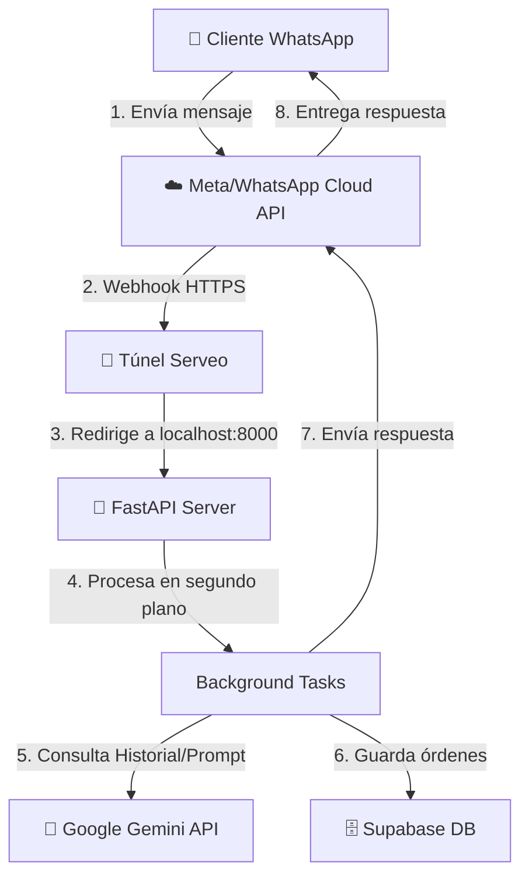

# 🏗️ Arquitectura del Sistema - BurgerBot Express Bot

Este documento describe la estructura técnica, flujo de datos, tecnologías y hosting del bot de WhatsApp para **BurgerBot Express**.

---

## 1. Diagrama de Flujo de Datos
El bot funciona mediante un flujo síncrono/asíncrono de Webhooks y llamadas de API en la nube:

---

## 2. Tecnologías y Componentes

### ⚙️ Backend (FastAPI / Uvicorn)
* **Función:** Recibe los webhooks de Meta, procesa los comandos del administrador y coordina la lógica de negocio.
* **Punto de Entrada:** `main.py`
* **Servidor Local:** Corriendo en `http://localhost:8000` con recarga automática.

### 🧠 Motor de IA (Google Gemini SDK)
* **Modelo:** `gemini-flash-lite-latest` (rápido, económico y preciso para tareas de texto).
* **Ubicación:** `ai_service.py`
* **Técnica:** Utiliza *Structured Outputs* (Herramientas/Tools) mediante la función `finalizar_pedido` para extraer de forma estructurada los datos de la comanda (nombre, artículos, cantidades, delivery, pago).

### 🗄️ Base de Datos (Supabase / PostgreSQL)
* **Función:** Persistencia de pedidos y perfiles de clientes.
* **Ubicación:** `db_service.py`
* **Conexión:** Mediante la biblioteca oficial `supabase-py`.

### 🛵 Notificación a Deliverys (WhatsApp Cloud API)
* **Función:** Envío de mensajes normales, botones interactivos de aprobación y broadcasts de entrega.
* **Ubicación:** `whatsapp_service.py`

---

## ☁️ 3. Dónde está Alojado Todo (Hosting Actual)

| Componente | Servicio / Proveedor | Estado Actual | Detalles |
| :--- | :--- | :--- | :--- |
| **Servidor Bot** | Localhost (Tu PC) | running | Ejecutándose mediante Python en PowerShell. |
| **Base de Datos** | **Supabase Cloud** | activo | Alojada en el plan gratuito en la nube de Supabase. |
| **IA (Gemini)** | **Google AI Studio** | activo | Acceso directo mediante API Key. |
| **Servicio de Webhook** | **Meta Developers** | activo | Configurado en modo Sandbox / Desarrollo. |
| **Enlace Webhook** | **Serveo.net** (Túnel) | activo | Redirección HTTPS temporal (`ssh -R`). |
