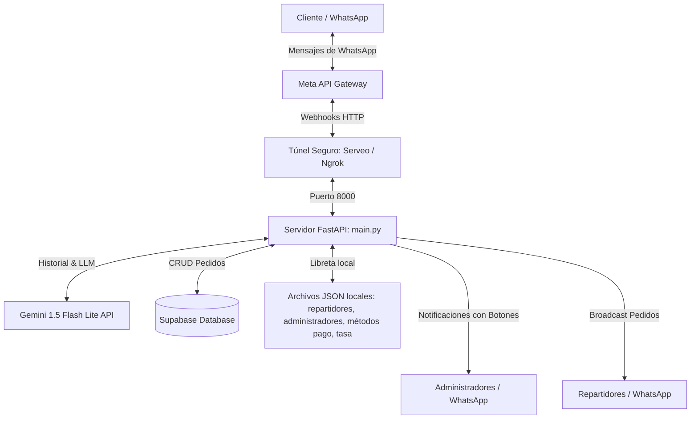
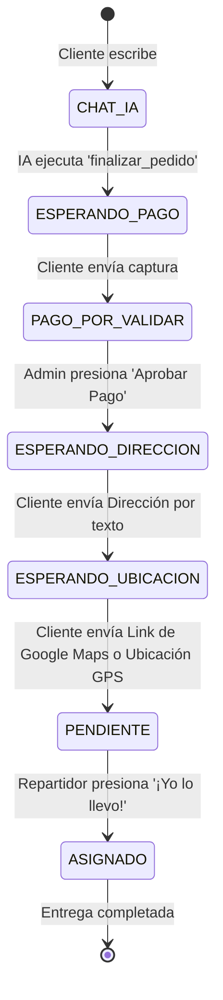

# Arquitectura del Proyecto y Checklist de Avance

Este documento describe la estructura técnica, componentes y flujos de datos del bot de delivery de BurgerBot Express, así como el control de avances y pendientes del proyecto.

---

## 📋 Arquitectura General del Sistema

El bot está diseñado como una aplicación orientada a eventos basada en webhooks que procesa mensajes de WhatsApp en tiempo real.

### 1. Servidor Principal (`main.py`)
- Desarrollado en **FastAPI** y ejecutado con **Uvicorn** en el puerto `8000`.
- Expone dos rutas críticas:
  - `GET /webhook`: Validación obligatoria para que Meta verifique la URL del Webhook.
  - `POST /webhook`: Recibe todas las notificaciones de eventos de WhatsApp (mensajes de texto, imágenes, botones interactivos y ubicaciones GPS).

### 2. Capa de Inteligencia Artificial (`ai_service.py`)
- Utiliza la biblioteca oficial de Google GenAI (`google-genai`) conectada al modelo `gemini-flash-lite-latest`.
- El bot cuenta con memoria en RAM temporal (`SESSION_MEMORY`) para recordar el contexto de cada conversación.
- **Tool Calling (Llamada a Funciones):** Cuando la IA detecta que el cliente ya proporcionó los datos iniciales necesarios (nombre, zona y método de pago), llama a la función `finalizar_pedido` para extraer de forma estructurada los detalles del pedido y guardarlo automáticamente.

### 3. Persistencia de Datos (Supabase y Archivos JSON)
- **Supabase:** Almacena la tabla `pedidos` para gestionar la persistencia y estados de los pedidos de forma robusta.
- **Archivos locales JSON:**
  - `repartidores.json`: Almacena la libreta de teléfonos y nombres de los repartidores asignados.
  - `administradores.json`: Almacena la libreta de teléfonos y nombres de los administradores secundarios autorizados.
  - `metodos_pago.json`: Configuración dinámica de los métodos de pago (pago móvil, zelle, etc.).
  - `tasa.json`: Archivo de emergencia para fijar manualmente la tasa del dólar si el servicio automático falla.

---

## 🔄 Flujo de Estados de un Pedido (Máquina de Estados)

Para resolver el problema del suministro desordenado de datos, el flujo se ha estructurado en fases consecutivas y seguras:

1. **Fase de Pedido (IA):** El cliente interactúa con la IA hasta confirmar su pedido, nombre, zona de entrega y método de pago. El pedido se inserta con estado `ESPERANDO_PAGO`.
2. **Fase de Pago:** El cliente recibe la tasa BCV y los datos bancarios formateados. Envía la captura del pago móvil o Zelle. El bot cambia el estado a `PAGO_POR_VALIDAR` y alerta a **todos los administradores** con botones interactivos.
3. **Fase de Dirección:** Al aprobarse el pago por cualquier administrador, el bot cambia el estado a `ESPERANDO_DIRECCION` y le solicita por mensaje la dirección escrita al cliente.
4. **Fase de Ubicación:** Al recibir la dirección, cambia a `ESPERANDO_UBICACION` y pide la ubicación de Google Maps o GPS nativo de WhatsApp.
5. **Notificación al Repartidor:** Al completarse dirección y mapa, el estado cambia a `PENDIENTE` y se envía el broadcast interactivo automático a los repartidores registrados.

---

## 📋 Checklist de Control y Avance

### 🟢 Completado e Implementado
- [x] **Flujo Automatizado de Pedidos con IA:** Integración con Gemini Flash Lite para tomar pedidos, calcular totales de comida e identificar la zona de entrega del cliente.
- [x] **Tasa BCV Automática:** Consulta automática del promedio oficial del BCV a través de DolarAPI con fallback local y comando de fijación manual.
- [x] **Gestión Dinámica de Métodos de Pago:** Posibilidad de agregar, eliminar, activar y desactivar métodos de pago al vuelo desde WhatsApp.
- [x] **Gestión de Repartidores:** Libreta local de repartidores que permite agregar y eliminar números telefónicos mediante comandos.
- [x] **Panel de Aprobación de Pago:** Sistema de botones interactivos para el Administrador para verificar y aprobar/rechazar las capturas enviadas por los clientes.
- [x] **Flujo Seguro en Dos Pasos para Datos de Entrega (Dirección y Mapa):** Solicitar la dirección exacta y la ubicación GPS del cliente **únicamente** después de recibir y validar el pago.
- [x] **Gestión Dinámica de Administradores Secundarios:** Capacidad para que el Súper Admin principal agregue y elimine otros números con permisos de administrador por comandos de WhatsApp. (Implementado en `main.py`).

### 🟡 En Progreso / Pendientes Inmediatos
- [ ] Pruebas y validaciones locales del nuevo sistema de permisos de administradores.

### 🔴 Futuras Mejoras / Pendientes a Mediano Plazo
- [ ] **Plantillas de Mensajes Aprobadas por Meta:** Crear plantillas aprobadas en la consola de Meta para poder notificar a los repartidores y clientes saltándose la restricción de las 24 horas de la API de WhatsApp.
- [ ] **Despliegue en Servidor VPS Cloud:** Mudar el bot local a un servidor virtual privado en la nube (como Render, AWS o DigitalOcean) para funcionamiento continuo 24/7 sin depender de la terminal del computador.
- [ ] **Persistencia de Sesión de Chat en Base de Datos:** Guardar el historial de chat con la IA en Supabase en lugar de guardarlo en RAM temporal (`SESSION_MEMORY`), para evitar pérdidas al reiniciar el servidor.
